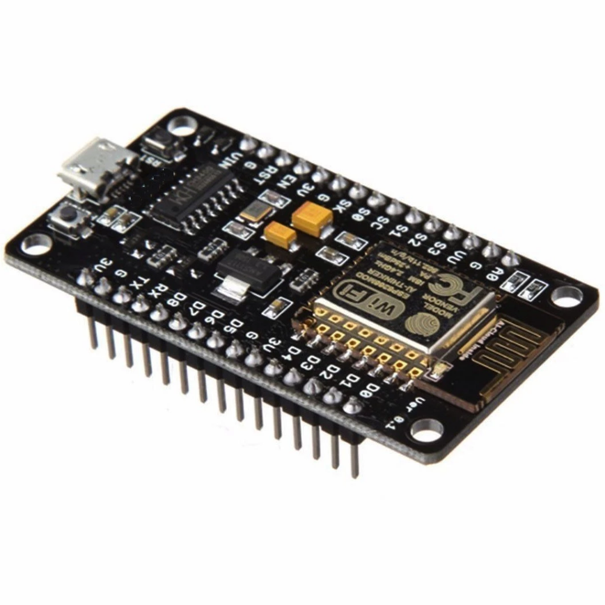
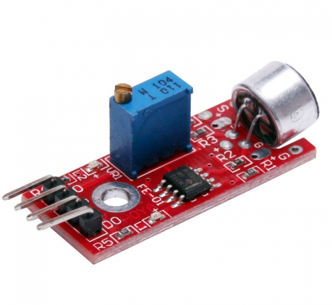
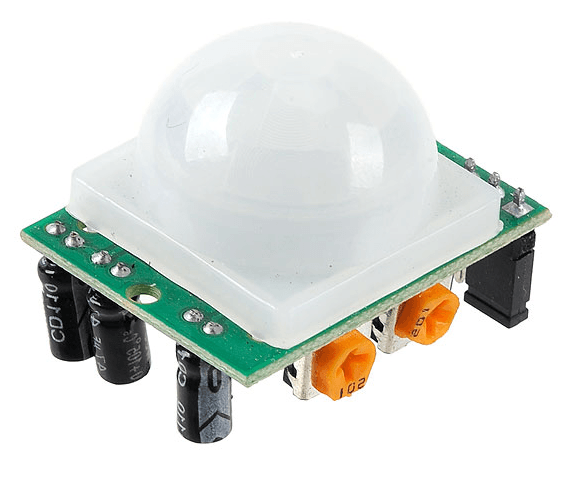

  
  

  # Get a Room

Team 4 BITS
  - Alain Vicencio Arizabalo A01620758
  - Fernando Josué Matute A00833375
  - Juan Pablo Martinez Valdivia
  - Ricardo Navarro Gómez A01708825
  - Salvador Rodríguez Paredes A01704562

## **Neccessity**
The students and collaborators from Tecnológico de Monterrey do not have a clear, direct nor an immediate way of knowing which classrooms are occupied and which aren't in a camps building. This affects the students that want to find an empty classroom to do their activities with no interruptions. This also affects the appropiate consumption of electrical energy, since there are cases where a classroom is not occupied yet the lights are still one. Finally, it also affects the optimization of the patrol routes for the security staff, since they have no way of telling if a classroom is emty when it should be.

## **Solution**
A web application that allows the Tec community to easily know if a campus classroom is empty or not based on sound and movement sensors, whose results are stored in a data base. 

## **Software used**
  - MySQL Data Base
  

  
   
  Download here either one:
   
  XAMPP: https://www.apachefriends.org/index.html
   
  MAMP (Used in our implementation): https://www.mamp.info/en/downloads/
  

  
  - Arduino
  

  
   
  Download here:
   
  https://www.arduino.cc/en/software
  

  
  - Node JS
  

  
   
  Download here:
   
  https://nodejs.org/en/download/
  

  
  - React
  

  
   
  Download here:
   
  https://en.reactjs.org
  

  
## **Hardware**
- Node MCU ESP8266
  

  
   
  Setting up your ESP8266:
   
  https://randomnerdtutorials.com/installing-the-esp32-board-in-arduino-ide-windows-instructions/
   
  Arduino ESP8266 Pinouts:
   
  https://esp8266-shop.com/esp8266-guide/esp8266-nodemcu-pinout/
  

  
- Sound sensor
  

  
   
  Testing the Sound Sensor:
   
  https://randomnerdtutorials.com/guide-for-microphone-sound-sensor-with-arduino/
   
  Datasheet:
   
  https://cdn.awsli.com.br/945/945993/arquivos/sound%20sensor%20module.pdf
  

  
- Movement sensor
  

  
   
  Testing the Motion Sensor:
   
  https://randomnerdtutorials.com/arduino-with-pir-motion-sensor/
   
  Datasheet:
   
  https://www.epitran.it/ebayDrive/datasheet/44.pdf
  

  
- Debbuging:
  

  Failed to connect to ESP32: Timed out waiting for packet header:
   
  https://www.arduino.cc/en/software](https://randomnerdtutorials.com/?s=+Timed+out+waiting+for+packet+header)
  

## **Data Base**
 - Script:
   

     CREATE TABLE salon(
        salon_id INT NOT NULL PRIMARY KEY,
        capacidad INT,
        imagen TEXT
    );

    CREATE TABLE OCUPADO(
      salon_id INT NOT NULL,
        estado INT NOT NULL,
        hora TIME NOT NULL,
        fecha DATE NOT NULL,
        luz INT,
        PRIMARY KEY(estado, hora, fecha)
    );

    ALTER TABLE OCUPADO
    ADD FOREIGN KEY (salon_id) REFERENCES SALON(salon_id);

   

   
 - Connection from Node MCU to Data Base:
   

     This is where the Node.js server comes into play. Proceed if downloaded.
   

 
 - From NODE MCU to server:
   

     In the arduino code, once certain specifications are reached, the NodeMCU will send a data string to the server, this is in the for of
     
        - If there is both sound and movement, and the lights are on. Sends to server classrooom id (3101), status (1) and light status (1).  
        - If there is both sound and movement, and the lights are off. Sends to server classroom id (3101), status (1) and light status (0).  
        - If there no sound or no movement, and the lights are on. Sends to server classroom id (3101), status (0) and light status (1).  
        - In any other case, sends to server classroom id (3101), status (0) ad light status (0).
     
     Remember from Hardware explanation that the status of classroom is marked as 'occupied' (with 1) only when it detects both sound and movement.
     What this part of the code does is send a POST request for the addition of the data string to the Data Base.
     
 Code for connexion, alongside its elxanation in commentry is in the following direction.
 code_server/index.js

  

  
 - From Server to Data Base:
   

       Once the POST request is sent, the js document sets the connection to the database and executes the querry to insert the values sent from the Node MCU.  
       Note that the NodeMCU does not send time and date, this is set in the JS code.  
       The code for this, along with its explanation in comments is available in the following rout:  
       iot_project/code_server/index.js /
       
  
 
  
## **Web Page**

