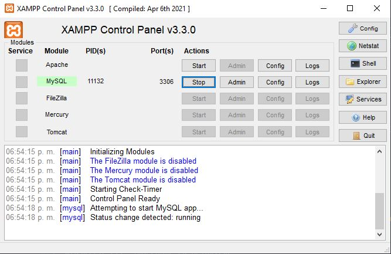
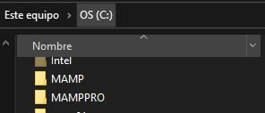
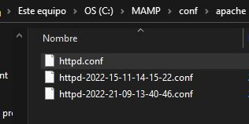
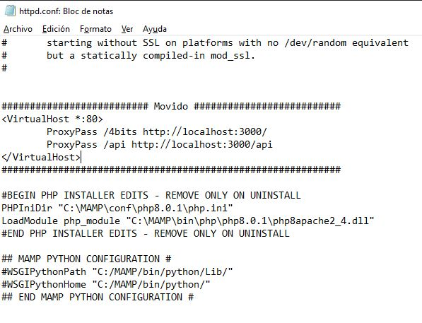

# ¿Cómo correr el servidor?
Para correr nuestro servidor necesitamos 2 cosas: el servidor web y el servidor de 
la base de datos. Hasta el momento solo he logrado configurar el servidor de apache 
en MAMP para servir nuestra applicación en la ruta `http://dirección.ip/4bits` por 
lo tanto si usan _MAPM_ solo deberán cambiar un archivo en la configuración.

En el caso de _XAMPP_ no pude configurar correctamente el servidor para que funcionara 
así si lo ocupan deberemos usar un servidor de _nginx_, el cual incluyo en este 
directorio ya configurado, de todas formas usaremos _XAMPP_ pero solo encenderemos el servicio de _MySql_.

---
Sigan los pasos para _MAMP_ y _XAMPP_ dependiendo de lo que usen y finalmente 
corran la aplicación.

## Para correr la aplicación
---
Primero deben tener instalado [node.js](https://nodejs.org/en/).

Una vez instalado, navega al folder donde está el archivo _index.js_ y corre el comando
```
node . 
```
ó
```
node index.js
```
## Configuración para XAMPP
---
Realmente no hay mucho que configurar, simplemente como no vamos a usar _Apache_
tendremos el problema de que no podremos usar _phpMyAdmin_ mientras el otro servidor 
está corriendo.

Naveguen a la siguiente ruta desde el directorio de este proyecto 
```
\iot_project\code_server\nginx_server
```

Ya está configurado todo para que las rutas funcionen igual así que usen los siguientes 
comandos para manejar el servidor, realmente solo deben usar los de `start` y `stop` 
pero agrego los demás que nos da la documentación:

### Iniciar y parar el servidor
```
start nginx
nginx -s stop
```
### Enlistar los procesos que están corriendo y forzar su salida por si no quieren parar
```
@tasklist /fi "imagename eq nginx.exe"
@taskkill /f /im nginx.exe
```
### Otros
```
nginx -s quit                 // Para parar el servidor... También... Creo...
nginx -s reload               // Volver a iniciar el servidor
nginx -s reopen               // Volver a abrir el servidor???

```



Después en _XAMPP_ inicien únicamente el servicio de _MySql_ y la aplicación ya 
debería funcionar correctamente con su conexión a la base de datos.

## Configuración para MAMP
---


Si hicieron una instalación por defecto de _MAMP_, sus archivos deberían estar en 
`C:\` en cualquier otro caso tomen el directorio de instalación como su ruta base. 
De ese directorio navegen a :
```
C:\MAMP\conf\apache
```
Recordando replazar `C:\` por a ruta base si lo instalaron en otra parte.



Aquí encontrarán el archivo `httpd.conf`, ábranlo con el block de notas o con el 
editor de texto de su preferencia y peguen la siguiente etiqueta casi al final del 
archivo:

```
<VirtualHost *:80>
	ProxyPass /4bits http://localhost:3000/
	ProxyPass /api http://localhost:3000/api
</VirtualHost>
```



No creo que haya mucho problema si lo pegan en otra parte del archivo pero para 
estar seguros intenten que quede en el mismo lugar que en la foto.

Ahora si, pueden iniciar _MAMP_ y correr la aplicación de node.
